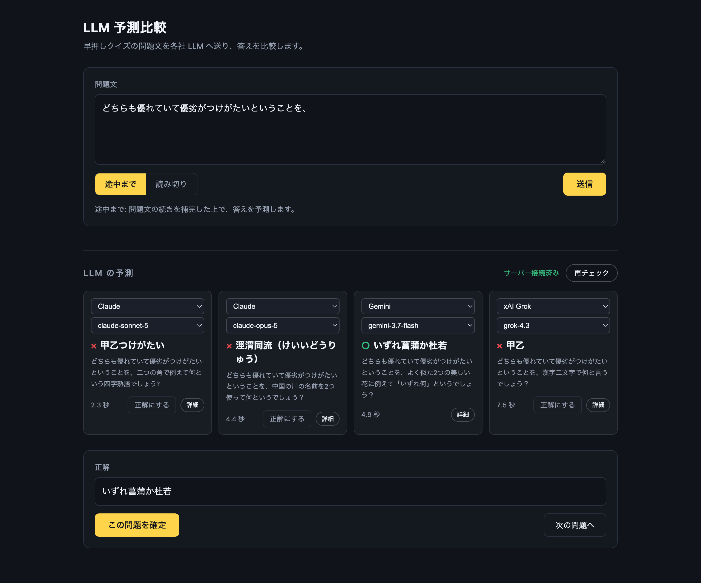
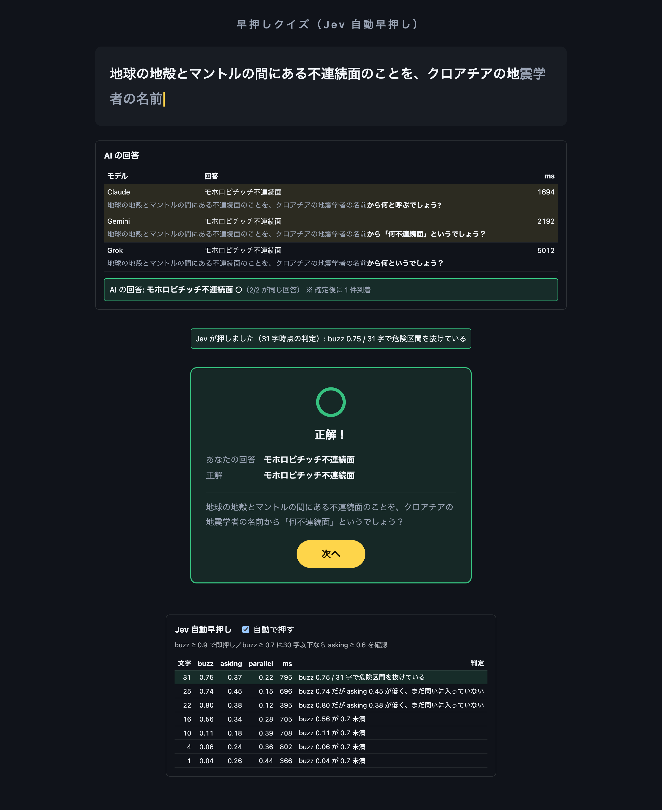

# AI横断クイズ (trans-ai-quiz)


早押しクイズの問題文を各社 LLM へ送り、続きの補完と答えを比較する。
現在の実験の主対象は [`llm-poc`](docs/llm.md) と [`jev-poc`](docs/jev-poc.md) である。

同一ネットワーク内で開催するオンライン早押し（投影 + スマホ）も持つ。
**AI を参加者として加えられる**（Jev が早押しし、3 モデルの合議で回答する）。
元になった 1 台完結の PoC（[`poc/`](docs/poc.md)）は凍結している。

## 構成

フロントは 4 つ（`llm-poc/`・`jev-poc/`・オンライン版・凍結 `poc/`）。
`server/` は LLM 中継・Jev 判定・オンライン版の早押し判定を担う共通バックエンドである。

出題データとジングル SE はリポジトリルートに置き、オンライン版・`jev-poc`・凍結 `poc/` で共有している。
`llm-poc` は問題データを使わない。


| ディレクトリ     | 内容                                                                                                   |
| ---------- | ---------------------------------------------------------------------------------------------------- |
| `llm-poc/` | LLM 予測比較の PoC。[詳細](docs/llm.md)                                                                      |
| `jev-poc/` | 人間 vs AI の早押し対決 PoC。Jev が押し、LLM が答える。[詳細](docs/jev-poc.md)                                           |
| `web/`     | オンライン版のフロントエンド。出題者用（投影）と回答者用（スマホ）。AI 参加者も持つ。[詳細](docs/online.md)                                     |
| `poc/`     | **凍結**。音声読み上げによる早押しの PoC。[詳細](docs/poc.md)                                                           |
| `server/`  | バックエンド（Python / FastAPI）。[LLM 中継](docs/llm.md)・[Jev 判定](docs/jev-poc.md)・[オンライン版の判定](docs/online.md) |
| `docs/`    | 詳細ドキュメント                                                                                             |


```
trans-ai-quiz/
├── docs/          詳細ドキュメント
├── quiz_data/     問題データ（CSV と VOICEPEAK の出力）
├── sound/         ジングル SE
├── server/        バックエンド（オンライン版の判定・LLM 中継・Jev 判定）
├── web/           オンライン版フロントエンド
├── llm-poc/       LLM 予測比較 PoC
├── jev-poc/       人間 vs AI 早押し対決 PoC
└── poc/           音声早押し PoC（凍結）
```

## 必要なもの

- Node.js 20 以上
- オンライン版・`llm-poc`・`jev-poc` を動かす場合は、追加で Python 3.12 以上と [uv](https://docs.astral.sh/uv/)
- LLM 予測を使う場合は、各社の API キー
- 自動早押しを使う場合は、[TypeSafe](https://docs.typesafe.ai/) の API キー
- 音声読み上げをする場合は、 VOICEPEAK からの出力が必要

## セットアップ

```bash
npm install
```

npm workspaces 構成のため、リポジトリルートで実行する。

## クイズ問題 - `quiz_data/`

オンライン版・`jev-poc`・凍結 `poc/` では、クイズ問題 `quiz_data/questions.csv` が最低 1 問必要（`llm-poc` は不要）。
無い場合もサーバは起動するが、オンライン版の `/host` `/player` `/ws` は 503 になる。

```bash
cp quiz_data/questions_example.csv quiz_data/questions.csv
```

さらに、VOICEPEAKからデータ（`.wav` / `.txt` / `.lab`）を出力することで、音声読み上げを行い、音声に同期して問題文を表示することが出来る。

VOICEPEAKデータが無い場合も、`quiz_data/questions.csv` に行を足すだけで出題できる（読み上げなし・1 文字ずつ等速の文字送りになる）。

問題データの形式は [docs/quiz-data.md](docs/quiz-data.md)。

## ジングル SE - `sound/`

問題の読み上げ音声とは別に、早押しのフィードバックとして鳴らすことが出来る。ジングルSEは無くても動作する。


| ファイル名         | 再生タイミング               |
| ------------- | --------------------- |
| `set.WAV`     | 出題時（この再生完了後に問題音声が始まる） |
| `buzz.WAV`    | 早押し時                  |
| `correct.WAV` | 正解時                   |
| `wrong.WAV`   | 不正解時                  |

## オンライン版、LLM・Jevサーバー - `server/`


`llm-poc`、凍結`poc`におけるLLMの中継、`jev-poc`におけるJev判定、およびオンライン版の判定を行う。

```bash
cp server/.env.example server/.env
# オンラインクイズを行う場合のみ、フロントをビルドする
npm run build -w web
```

```bash
cd server
uv sync
# オンラインクイズを行わない場合
uv run uvicorn app.main:app --port 8000
# オンラインクイズを行う場合
uv run uvicorn app.main:app --host 0.0.0.0 --port 8000
```

起動すると、出題者用 URL（トークン付き）と参加者用 URL が表示される。

> [!IMPORTANT]
> `--host 0.0.0.0` を省くと `127.0.0.1` に bind され、**参加者のスマホから繋がらない**。
> 繋がらないときの切り分けは [docs/online.md](docs/online.md#参加者のスマホから繋がらないとき)。

AI に早押しボタンを押させる場合は、`server/.env` に `TYPESAFE_API_KEY` と各社の API キーを設定する。
出題者画面の「AI 参加者」で参加を切り替える。

`--workers` は増やさないこと。ルームの状態はプロセス内のメモリに持つ。

オンライン早押しクイズの開催手順・開発時の起動は [docs/online.md](docs/online.md)。

## LLM 予測比較 - `llm-poc/`



早押しクイズの問題文を手入力し、各社 LLM へ送信、答えを比較する。

`server/.env` に使うプロバイダのキーを設定する。


| 環境変数                | 用途            |
| ------------------- | ------------- |
| `OPENAI_API_KEY`    | OpenAI        |
| `ANTHROPIC_API_KEY` | Claude        |
| `GEMINI_API_KEY`    | Google Gemini |
| `XAI_API_KEY`       | xAI Grok      |


`server` を起動した上で、別のターミナルでフロントを起動する。

```bash
npm run dev -w llm-poc
```

操作・記録・プロンプトは [docs/llm.md](docs/llm.md)。

## Jevによる早押し判定 - `jev-poc/`



読み上げ中の問題文を Jev へ随時投げ、確定ポイントと判断したら自動で早押しする。
**押した側が答える。** Jev が押せば 3 モデルの合議で AI が回答し、人間が押せば人間が回答する。
AI が外したら読み上げが再開され、人間へ解答権が移る。

`server/.env` に `TYPESAFE_API_KEY` を設定して、`server/` を起動しておく（未設定でも手動の早押しは動く）。
AI に回答させる場合は、`llm-poc`と同様に、各社の API キーも設定する。

```bash
npm run dev -w jev-poc
```

押下判定の設計と閾値の調整手順は [docs/jev-poc.md](docs/jev-poc.md)。
